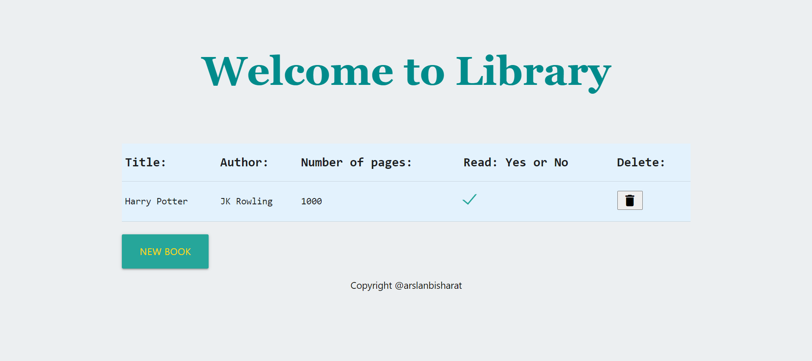

# Library

This is a Simple Javascript project where we dynamically ad books and store in localstorage.

## Built With

- Html
- CSS
- Javascript

## Live Demo

[Live Demo Link](https://rawcdn.githack.com/arslanbisharat/LIBRARY/e0ad22f92043bf3126f8203b47594bcca1c59683/index.html)

## Author

 **Muhammad Arslan**

- Github: [@githubhandle](https://github.com/arslanbisharat)
- Twitter: [@twitterhandle](https://twitter.com/arslan_bisharat-2020bb156)
- Linkedin: [linkedin](https://www.linkedin.com/in/muhammad-arslan)

## 🤝 Contributing

Contributions, issues and feature requests are welcome! Start by:
* Forking the project
* Cloning the project to your local machine
* `cd` into the Youtube-Replica project directory
* Run `git checkout -b your-branch-name`
* Make your contributions
* Push your branch up to your forked repository
* Open a Pull Request with a detailed description to the development branch of the original project for a review

## 📝 License

This project is [MIT](https://opensource.org/licenses/MIT) licensed.
